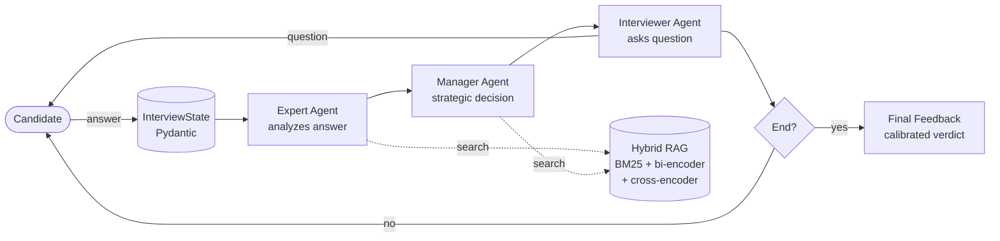

# Multi-Agent Interviewer

> AI-powered technical interview coach. Three specialized agents (Expert, Manager, Interviewer) collaborate via [LangGraph](https://github.com/langchain-ai/langgraph) to conduct realistic interviews and produce calibrated hiring feedback.

[](https://www.python.org/downloads/release/python-313/)
[](#tests)
[](https://mypy.readthedocs.io/)
[](https://github.com/astral-sh/ruff)
[](LICENSE)

[Русская версия](README.ru.md) · [Architecture](docs/ARCHITECTURE.md) · [Prompting](docs/PROMPTING.md)

---

## What this project does

Conducts a technical interview with a candidate, end-to-end:

1. Collects the candidate's stated role, level, and experience.
2. Asks targeted technical questions, adapting difficulty based on previous answers.
3. After each turn, three agents run in sequence:
   - **Expert** analyzes technical correctness and identifies knowledge gaps.
   - **Manager** evaluates progress, soft skills, and decides on strategic direction.
   - **Interviewer** generates the next question.
4. At the end, produces a calibrated final report — verdict, confidence, confirmed skills, knowledge gaps, behavioral red flags, learning roadmap.

The output is a structured JSON report you can pipe into any downstream system, plus a human-readable summary in the terminal.

## Why this is different from "just call ChatGPT"

A naive ChatGPT prompt produces a single agent with no separation of concerns: it asks questions, evaluates them, and decides when to stop, all in one tangled context. This system separates these into specialized agents with structured handoffs, applies deterministic policies on top of LLM decisions (e.g. minimum interview length, hard caps on confidence at low data volume, behavioral-flag-triggered downgrades), and runs hybrid retrieval over an external knowledge base when available.

The result is more consistent verdicts, traceable reasoning per turn, and resistance to common LLM failure modes (positivity bias, hallucinated structure, rate-limit cascades).

## Demo

```
============================================================
  MULTI-AGENT INTERVIEW COACH
============================================================

=== Candidate setup ===
Name: Alex
Position: Backend Developer
Grade: Middle
Experience: 4 years Python, FastAPI, PostgreSQL

────────────────────────────────────────────────────────────
 MANAGER AGENT
────────────────────────────────────────────────────────────
Прогресс: Интервью только началось, данных пока нет.
Soft skills: 0/10
Стратегия: Начать с открытого вопроса о ключевом проекте,
оценить структурированность изложения и глубину технических
решений.

Interviewer: Расскажите о самой сложной технической задаче,
с которой вы сталкивались за последний год. Какое решение
выбрали и почему?

[Turn 1] Your answer (blank line to send):
> ...

────────────────────────────────────────────────────────────
 EXPERT AGENT
────────────────────────────────────────────────────────────
Корректность ответа: технически грамотное описание...
Пробелы:
  • Не упомянута обработка race conditions
  • ...

────────────────────────────────────────────────────────────
 ИТОГОВАЯ ОЦЕНКА
============================================================
Уровень:        Middle
Рекомендация:   Hire
Уверенность:    78%
```

A complete sample report lives in [`examples/`](examples/).

## Quick start

You'll need [Docker](https://www.docker.com/) and a [Mistral API key](https://console.mistral.ai/) (free tier works).

```bash
git clone https://github.com/Nekebab/multiagent-interviewer.git
cd multiagent-interviewer

cp .env.example .env
# edit .env and set MISTRAL_API_KEY=...

docker compose build
docker compose run --rm app
```

First run downloads ~3 GB of embedding/reranker models into a Docker volume; subsequent runs start in seconds.

## Architecture



Each turn is a single graph invocation: `expert → manager → interviewer → END`. The graph runs once per candidate response. Between turns, the CLI captures user input. State is a Pydantic `BaseModel` — every transition is validated.

For a deeper dive into agent prompts, state design, retry logic, and trade-offs: [`docs/ARCHITECTURE.md`](docs/ARCHITECTURE.md).

## Key features

### Multi-agent orchestration via LangGraph
Three single-responsibility agents (Expert, Manager, Interviewer) instead of one monolithic prompt. Each agent has its own Jinja2 template, structured Pydantic output, and isolated context.

### Hybrid retrieval
RAG combines lexical (BM25 with Russian lemmatization via [pymorphy3](https://github.com/no-plagiarizm/pymorphy3)) and dense (bi-encoder via [sentence-transformers](https://www.sbert.net/)) retrieval, then reranks with a cross-encoder. This is the standard production-grade RAG stack — significantly better recall than vector search alone.

### Calibrated final assessment
The final feedback is **not** trusted blindly from the LLM. Instead:
- A calibration table in the prompt explicitly maps confidence ranges to data volume.
- Deterministic post-processing caps confidence based on the number of substantive turns.
- Behavioral red flags (off-topic deflections, evasions, factual confusion) downgrade the recommendation regardless of technical content.

This addresses **positivity bias** — a well-known issue where RLHF-trained models default to encouraging assessments. See [`docs/ARCHITECTURE.md#calibration`](docs/ARCHITECTURE.md#calibration) for details.

### Defense-in-depth for structured output
LLMs occasionally return malformed JSON despite explicit instructions: arrays where strings are expected, schema-shaped objects instead of data, JSON-wrapped text in plain-text fields. The system handles these at three layers:
1. **Prompt-level**: explicit format instructions plus a concrete example built from the Pydantic schema.
2. **Validator-level**: Pydantic `field_validator(mode="before")` coerces common deviations (e.g. list→string for the manager's `direction` field).
3. **Post-processing**: regex-free unwrapping of accidentally-JSONified responses (`_strip_json_wrapper` in the interviewer).

### Production-grade engineering
- **110+ tests** covering RAG, agents, graph, feedback, and CLI flows.
- **Strict mypy** (`warn_return_any`, `disallow_untyped_defs`, `no_implicit_optional`).
- **Ruff** for lint and formatting; **pre-commit** runs the whole stack.
- **Multi-stage Docker build** with CPU-only PyTorch (~1.5 GB image vs ~5 GB with CUDA).
- **Tenacity-based retry** that handles HTTP 429 (rate limit) and 5xx with exponential backoff.
- **Loguru-safe retry logging** — works around a known gotcha where exception messages containing `{...}` (e.g. JSON error bodies from APIs) crash loguru's `str.format`-style logger.

## Tech stack

| Layer | Tool |
|---|---|
| Orchestration | LangGraph |
| Validation | Pydantic v2 |
| LLM | Mistral (default), pluggable |
| Embeddings | sentence-transformers |
| Lexical search | rank-bm25 + pymorphy3 |
| Dense search | FAISS (CPU) |
| Templates | Jinja2 (`StrictUndefined`) |
| Logging | Loguru |
| Retry | Tenacity|
| Packaging | uv + hatchling |
| Linting | Ruff |
| Type-checking | mypy |

## Project structure

```
multiagent-interviewer/
├── src/multiagent_interviewer/
│   ├── agents/                # Expert, Manager, Interviewer node factories
│   ├── graph/
│   │   ├── builder.py         # LangGraph assembly
│   │   └── state.py           # Pydantic models for state and structured outputs
│   ├── llm/
│   │   └── client.py          # Provider-agnostic LLM client + retry
│   ├── prompts/               # Jinja2 templates (expert.j2, manager.j2, interviewer.j2)
│   ├── rag/
│   │   ├── retriever.py       # Hybrid BM25 + bi-encoder + cross-encoder
│   │   └── system.py          # CSV loader, chunking
│   ├── cli.py                 # Interactive entry point
│   ├── config.py              # Pydantic Settings
│   ├── feedback.py            # Final assessment with calibration policies
│   └── logging_setup.py
├── tests/                     # 110+ tests, all green
├── docs/
│   ├── ARCHITECTURE.md        # Design decisions, trade-offs
│   └── PROMPTING.md           # Prompt engineering details
├── examples/                  # Sample interview reports (JSON)
├── Dockerfile                 # Multi-stage, CPU-only, non-root
├── docker-compose.yml         # Dev setup with volume mounts
├── pyproject.toml
└── uv.lock
```

## Configuration

All configuration via environment variables (see `.env.example`):

| Variable | Default | Description |
|---|---|---|
| `MISTRAL_API_KEY` | (required) | Your Mistral API key |
| `LLM_MODEL` | `mistral-large-latest` | Model name |
| `LLM_TEMPERATURE` | `0.7` | Sampling temperature |
| `MAX_TURNS` | `10` | Hard cap on interview length |
| `MIN_TURNS_BEFORE_END` | `8` | Manager cannot end before this |
| `CHUNK_SIZE` | `500` | RAG chunk size in characters |
| `CHUNK_OVERLAP` | `50` | RAG chunk overlap |
| `LOG_LEVEL` | `INFO` | Loguru log level |

## Development

```bash
# Install dependencies (creates .venv)
uv sync

# Run tests
uv run pytest -v

# Lint and format
uv run ruff check
uv run ruff format

# Type-check
uv run mypy src tests

# Run all checks (pre-commit)
uv run pre-commit run --all-files

# Run locally without Docker
uv run multiagent-interviewer
```

## Engineering challenges solved

A few problems that turned out to be more interesting than expected:

- **PyTorch pulls 2.5 GB of CUDA libraries by default**, even on machines with no GPU. The Docker image went from 5 GB to 1.5 GB after pinning torch to the CPU-only index via `[tool.uv.sources]`.

- **Loguru + Tenacity's `before_sleep_log` crash on JSON error messages.** Tenacity passes the exception text to loguru's `str.format`-style logger; if the exception contains `{...}` (e.g. an API error body), loguru tries to interpret the braces as placeholders and raises `KeyError`. Solved with a custom `before_sleep` callback that uses positional `{}` placeholders.

- **LLMs sometimes return JSON Schema instead of data matching the schema.** The fix wasn't a better prompt — it was including a concrete example built dynamically from `model_fields` (via `_example_from_schema`) alongside the schema. Most failures disappeared.

- **Manager agent occasionally returned `direction` as a list of strings instead of a single string.** Pydantic `field_validator(mode="before")` coerces lists into newline-separated strings without changing the schema.

- **The first version of final feedback gave "Strong Hire 90%" for a single answer.** Solved with a calibration table in the prompt, deterministic confidence caps based on turn count, and behavioral-flag-triggered downgrades. Detailed in [`docs/ARCHITECTURE.md#calibration`](docs/ARCHITECTURE.md#calibration).

## Roadmap

- **Rolling conversation memory**: summarize older turns to extend interview length without context bloat.
- **Conditional graph edges**: skip redundant Expert/Manager calls on the first turn.
- **Web frontend**: streaming interface (FastAPI + minimal React) for showcasing the system without a terminal.
- **LangSmith / Langfuse integration**: production-grade tracing of agent decisions.

## License

MIT — see [LICENSE](LICENSE).
