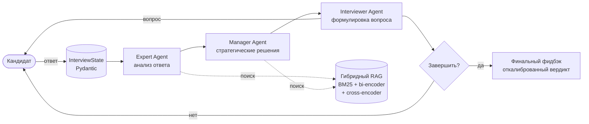

# Multi-Agent Interviewer

> AI-симулятор технического собеседования. Три специализированных агента (Expert, Manager, Interviewer) взаимодействуют через [LangGraph](https://github.com/langchain-ai/langgraph), проводят реалистичное интервью и формируют откалиброванный найм-фидбэк.

[](https://www.python.org/downloads/release/python-313/)
[](#тесты)
[](https://mypy.readthedocs.io/)
[](https://github.com/astral-sh/ruff)
[](LICENSE)

[English version](README.md) · [Архитектура](docs/ARCHITECTURE.ru.md) · [Промпты](docs/PROMPTING.ru.md)

---

## Что делает проект

Проводит технические интервью end-to-end:

1. Собирает данные кандидата — позиция, уровень, опыт.
2. Задаёт целевые технические вопросы, адаптируя сложность под предыдущие ответы.
3. После каждого хода последовательно работают три агента:
   - **Expert** анализирует техническую корректность ответа и фиксирует пробелы в знаниях.
   - **Manager** оценивает прогресс, soft skills и решает стратегическое направление.
   - **Interviewer** формулирует следующий вопрос.
4. В конце выдаёт откалиброванный отчёт — вердикт, уверенность, подтверждённые навыки, пробелы, поведенческие red flags, план обучения.

Итог — структурированный JSON-отчёт для downstream-обработки + читаемое summary в терминале.

## Чем отличается от "просто прокинуть в ChatGPT"

Простой промпт в ChatGPT — это один агент без разделения ответственности: задаёт вопросы, оценивает их, решает когда заканчивать — всё в одном перепутанном контексте. Эта система разделяет роли по специализированным агентам со структурированными передачами данных, применяет детерминированные политики поверх LLM-решений (минимальная длина интервью, hard caps на confidence при малом количестве данных, downgrade рекомендации при поведенческих red flags), и работает с гибридным retrieval по внешней базе знаний при её наличии.

В результате — более стабильные вердикты, прозрачная цепочка рассуждений на каждом ходу, устойчивость к типичным проблемам LLM (positivity bias, галлюцинированная структура, каскадные rate-limit ошибки).

## Демо

```
============================================================
  MULTI-AGENT INTERVIEW COACH
============================================================

=== Candidate setup ===
Name: Alex
Position: Backend Developer
Grade: Middle
Experience: 4 years Python, FastAPI, PostgreSQL

────────────────────────────────────────────────────────────
 MANAGER AGENT
────────────────────────────────────────────────────────────
Прогресс: Интервью только началось, данных пока нет.
Soft skills: 0/10
Стратегия: Начать с открытого вопроса о ключевом проекте,
оценить структурированность изложения и глубину технических
решений.

Interviewer: Расскажите о самой сложной технической задаче,
с которой вы сталкивались за последний год. Какое решение
выбрали и почему?

[Turn 1] Your answer (blank line to send):
> ...

────────────────────────────────────────────────────────────
 EXPERT AGENT
────────────────────────────────────────────────────────────
Корректность ответа: технически грамотное описание...
Пробелы:
  • Не упомянута обработка race conditions
  • ...

────────────────────────────────────────────────────────────
 ИТОГОВАЯ ОЦЕНКА
============================================================
Уровень:        Middle
Рекомендация:   Hire
Уверенность:    78%
```

Полный пример отчёта лежит в [`examples/`](examples/).

## Быстрый старт

Понадобятся [Docker](https://www.docker.com/) и [API-ключ Mistral](https://console.mistral.ai/) (бесплатного тира хватает).

```bash
git clone https://github.com/Nekebab/multiagent-interviewer.git
cd multiagent-interviewer

cp .env.example .env
# отредактировать .env, прописать MISTRAL_API_KEY=...

docker compose build
docker compose run --rm app
```

Первый запуск качает ~3 ГБ моделей в Docker volume; последующие запуски — за секунды.

## Архитектура



Каждый ход — одно обращение к графу: `expert → manager → interviewer → END`. Граф запускается раз на ответ кандидата. Между ходами CLI собирает ввод. State — Pydantic `BaseModel`, каждая трансформация валидируется.

Подробно про промпты, дизайн state, retry-логику и trade-offs: [`docs/ARCHITECTURE.ru.md`](docs/ARCHITECTURE.ru.md).

## Ключевые особенности

### Multi-agent оркестрация через LangGraph
Три агента с одной зоной ответственности (Expert, Manager, Interviewer) вместо одного монолитного промпта. У каждого свой Jinja2-шаблон, structured Pydantic output и изолированный контекст.


### Гибридный retrieval
RAG комбинирует лексический поиск (BM25 с русской лемматизацией через [pymorphy3](https://github.com/no-plagiarizm/pymorphy3)) и dense (bi-encoder через [sentence-transformers](https://www.sbert.net/)), затем ранжирует cross-encoder'ом. Это стандартный production-grade RAG-стек — recall значительно лучше, чем у чисто векторного поиска.

### Откалиброванная финальная оценка
Финальный фидбэк **не** доверяется LLM напрямую. Вместо этого:
- Калибровочная таблица в промпте явно связывает диапазоны confidence с объёмом данных.
- Детерминированный post-processing ограничивает confidence по числу ходов с ответами.
- Поведенческие red flags (off-topic, уход от ответа, базовые ошибки) понижают рекомендацию независимо от технического содержания.

Это решает **positivity bias** — известную проблему RLHF-моделей, склонных к мягким оценкам. Подробно — [`docs/ARCHITECTURE.ru.md#калибровка`](docs/ARCHITECTURE.ru.md#калибровка).

### Defense-in-depth для structured output
LLM иногда возвращают невалидный JSON несмотря на инструкции: массивы вместо строк, объекты-как-схемы вместо данных, JSON-обёртки в plain-text полях. Система обрабатывает это в трёх слоях:
1. **На уровне промпта**: явные инструкции по формату плюс конкретный пример, построенный из Pydantic-схемы.
2. **На уровне валидаторов**: Pydantic `field_validator(mode="before")` приводит частые отклонения к нужному типу (например, list→string для `direction` менеджера).
3. **На уровне post-processing**: распаковка случайно-JSON-нутых ответов без regex (`_strip_json_wrapper` в interviewer'е).

### Production-уровень инженерии
- **110+ тестов** покрывают RAG, агентов, граф, feedback, CLI.
- **Строгий mypy** (`warn_return_any`, `disallow_untyped_defs`, `no_implicit_optional`).
- **Ruff** для линта и форматирования; **pre-commit** запускает весь стек.
- **Multi-stage Docker** с CPU-only PyTorch (~1.5 ГБ образ против ~5 ГБ с CUDA).
- **Tenacity-based retry** обрабатывает HTTP 429 (rate limit) и 5xx с экспоненциальным backoff.
- **Loguru-safe retry logging** — обходит известную проблему: сообщения исключений с `{...}` (например, JSON-тело ошибки API) ломают `str.format`-логгер loguru.

## Стек

| Слой | Инструмент |
|---|---|
| Оркестрация | LangGraph |
| Валидация | Pydantic v2 |
| LLM | Mistral (default), pluggable |
| Embeddings | sentence-transformers |
| Лексический поиск | rank-bm25 + pymorphy3 |
| Dense-поиск | FAISS (CPU) |
| Шаблоны | Jinja2 (`StrictUndefined`) |
| Логирование | Loguru |
| Retry | Tenacity |
| Packaging | uv + hatchling |
| Линтинг | Ruff |
| Type-checking | mypy |

## Структура проекта

```
multiagent-interviewer/
├── src/multiagent_interviewer/
│   ├── agents/                # Expert, Manager, Interviewer node factories
│   ├── graph/
│   │   ├── builder.py         # Сборка графа LangGraph
│   │   └── state.py           # Pydantic-модели state и structured outputs
│   ├── llm/
│   │   └── client.py          # Provider-agnostic LLM-клиент + retry
│   ├── prompts/               # Jinja2-шаблоны (expert.j2, manager.j2, interviewer.j2)
│   ├── rag/
│   │   ├── retriever.py       # Hybrid BM25 + bi-encoder + cross-encoder
│   │   └── system.py          # CSV-загрузчик, chunking
│   ├── cli.py                 # Интерактивная точка входа
│   ├── config.py              # Pydantic Settings
│   ├── feedback.py            # Финальная оценка с calibration policies
│   └── logging_setup.py
├── tests/                     # 110+ тестов, всё зелёное
├── docs/
│   ├── ARCHITECTURE.md        # Design decisions, trade-offs
│   └── PROMPTING.md           # Детали prompt engineering
├── examples/                  # Примеры отчётов интервью (JSON)
├── Dockerfile                 # Multi-stage, CPU-only, non-root
├── docker-compose.yml         # Dev-конфигурация с volume mounts
├── pyproject.toml
└── uv.lock
```

## Конфигурация

Вся настройка через переменные окружения (см. `.env.example`):

| Переменная | Default | Описание |
|---|---|---|
| `MISTRAL_API_KEY` | (required) | API-ключ Mistral |
| `LLM_MODEL` | `mistral-large-latest` | Имя модели |
| `LLM_TEMPERATURE` | `0.7` | Sampling temperature |
| `MAX_TURNS` | `10` | Жёсткий потолок длины интервью |
| `MIN_TURNS_BEFORE_END` | `8` | Manager не завершит до этого |
| `CHUNK_SIZE` | `500` | Размер чанка RAG в символах |
| `CHUNK_OVERLAP` | `50` | Перекрытие чанков RAG |
| `LOG_LEVEL` | `INFO` | Уровень логирования loguru |

## Разработка

```bash
# Установить зависимости (создаст .venv)
uv sync

# Прогнать тесты
uv run pytest -v

# Линт и форматирование
uv run ruff check
uv run ruff format

# Type-check
uv run mypy src tests

# Все проверки (pre-commit)
uv run pre-commit run --all-files

# Запуск локально без Docker
uv run multiagent-interviewer
```

## Решённые инженерные задачи

Несколько проблем, которые оказались интереснее, чем выглядели:

- **PyTorch по умолчанию тянет 2.5 ГБ CUDA-библиотек**, даже на машинах без GPU. Образ Docker уменьшился с 5 ГБ до 1.5 ГБ после переключения torch на CPU-only индекс через `[tool.uv.sources]`.


- **Loguru + Tenacity `before_sleep_log` крашится на JSON-сообщениях.** Tenacity передаёт текст исключения в `str.format`-стиль логгер loguru; если в исключении есть `{...}` (например, JSON-тело API-ошибки), loguru пытается интерпретировать скобки как placeholder'ы и падает с `KeyError`. Решено кастомным `before_sleep` callback'ом с позиционными `{}` placeholder'ами.

- **LLM иногда возвращают JSON Schema вместо данных, соответствующих схеме.** Решилось не лучшим промптом — а добавлением конкретного примера, динамически собираемого из `model_fields` (через `_example_from_schema`) рядом со схемой. Большинство ошибок исчезло.

- **Manager-агент периодически возвращал `direction` как массив строк вместо одной строки.** Pydantic `field_validator(mode="before")` приводит list к строке через newline-join, не меняя схему.

- **Первая версия финального фидбэка выдавала "Strong Hire 90%" по одному ответу.** Решилось калибровочной таблицей в промпте, детерминированными confidence caps по количеству ходов, отдельным вердиктом `INSUFFICIENT_DATA`, и downgrade рекомендации при поведенческих red flags. Подробно — [`docs/ARCHITECTURE.ru.md#калибровка`](docs/ARCHITECTURE.ru.md#калибровка).

## Roadmap

- **Rolling conversation memory**: суммаризация старых ходов для удлинения интервью без распухания контекста.
- **Условные рёбра графа**: пропускать избыточные Expert/Manager на первом ходу.
- **Web frontend**: streaming-интерфейс (FastAPI + минимальный React) для демо без терминала.
- **Интеграция LangSmith / Langfuse**: production-grade трассировка решений агентов.

## Лицензия

MIT — см. [LICENSE](LICENSE).
